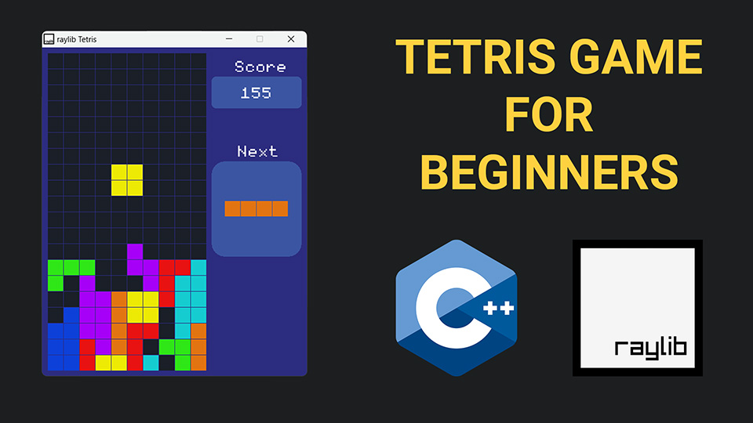

# C++ Tetris Game using raylib

🕹️🐍🎮 This GitHub repository is home to the full source code for a Tetris game built with the C++ programming language and the raylib library. 💻🎨🎧 The game uses various raylib functions for graphics, input handling, and audio and can be played on Windows, macOS, and Linux computers. 🔍📖 The code is well-structured and easy to read, making it a valuable resource for aspiring game developers looking to learn about raylib game programming.

If you want to learn how to build your own Tetris game with raylib,  👨‍💻  every line of code, explaining the logic behind it and demonstrating how it affects the game. You'll discover how to set up the game window, create the Grid and block classes, add collision detection, and implement sound effects. By the end of the tutorial, you'll have a fully functional Tetris game that you can play and modify however you like. ☕ So, grab a cup of coffee and let's dive into the exciting world of game development with raylib! 🚀

# Video Tutorial

  

🎥 

 
 

| 📺 
| 🌍 <a href="http://www.educ8s.tv">My Website</a> |  

